PayGreen
========

J'ai récemment déposé une candidature pour un poste de **développeur Backend Symfony** chez [PayGreen](https://paygreen.io) qui est une startup Rouennaise concurrente de _Stripe_ qui propose de la gestion de paiement en ligne, engagée dans une démarche solidaire et éco-responsable 👍.

Ils m'ont proposé un test technique sous la forme d'un mini projet à développer dont voici l'énoncé :

Énoncé
------

> Développer une petite API sous Symfony 5 avec quelques actions basiques listées ci-dessous.
>
> Limitez-vous dans le temps ! Nous regarderons avant tout votre approche générale du développement et votre façon de coder. Merci d'éviter les outils tels qu'API Platform et de nous montrer comment vous pouvez coder par vous-même.
>
> N'hésitez pas à nous indiquer par écrit ce que vous auriez aimé faire avec plus de temps, ou les problèmes que vous avez rencontrés.
>
> Route d'authentification d'un utilisateur
>
> Route permettant de créer un item "Transaction"
> -> Route réservée aux utilisateurs authentifiés
>
> Route permettant de lister les utilisateurs
> -> Route réservée aux administrateurs

L'énoncé est assez flou, mais du coup ça me laisse aussi pas mal de liberté pour faire un peu ce que je veux. Je vais donc en profiter pour me lancer un _challenge_ perso ;

**Je vais coder une API en utilisant le minimum nécessaire de composants Symfony 5** (c'est-à-dire en partant de symfony-skeleton) **et écrire un tuto complet du projet étape par étape en moins de 24h.**

🏁 C'est parti ! 🏁


📝 NOTE : Je vais quand même préciser que l'équipe de _PayGreen_ ne m'a obligé à rien du tout ; Je suis déjà en train de m'imaginer certains : _"Ouais... C'est un peu abusé d'exiger autant de travail à un candidat, tout ça, blabla..."_ Je suis bien conscient que je vais fournir un effort environ 10 fois plus intense que ce qu'ils m'ont demandé au départ...

📝 NOTE 2 : Je vais décrire tout le projet en partant de zéro en donnant le maximum de détails, je vais donc faire comme si vous étiez un débutant total.

📝 NOTE 3 : J'ai écrit ce tuto en français, mais tous les commentaires dans le code sont en anglais. On ne devrait **jamais** utiliser autre chose que de l'anglais dans le code. **Jamais**.

---

> **TL;DR**
>
> Entrez les commandes suivantes dans votre terminal :
>
> ```bash
> $ git clone https://github.com/TangoMan75/paygreen
> $ cd paygreen
> $ ./install.sh
> ```
>
> Et l'_API_ sera disponible ci : [http://localhost:8000](http://localhost:8000)

Table des matières
------------------

- [1 ⚡ Environnement de développement](#1--environnement-de-développement)
- [2 ⚡ Création du projet](#2--création-du-projet)
- [3 ⚡ Installation des dépendances du projet](#3--installation-des-dépendances-du-projet)
- [4 ⚡ Installation des dépendances de développement](#4--installation-des-dépendances-de-développement)
- [5 ⚡ Création des entités](#5--création-des-entités)
- [6 ⚡ Création de la base de donnée et du schéma](#6--création-de-la-base-de-donnée-et-du-schéma)
- [7 ⚡ Fixtures](#7--fixtures)
- [8 ⚡ Création des encodeurs](#8--création-des-encodeurs)
- [9 ⚡ Contrôleurs](#9--contrôleurs)
- [10 ⚡ Essayons d'envoyer des requêtes](#10--essayons-denvoyer-des-requêtes)
- [11 ⚡ Gestion de la création d'un nouvel élément](#11--gestion-de-la-création-dun-nouvel-élément)
- [12 ⚡ Création de l'authentification](#12--création-de-lauthentification)
- [13 ⚡ Permissions](#13--permissions)
- [⚡ Conclusion](#-conclusion)

1 ⚡ Environnement de développement
-----------------------------------

### 👉 Une parenthèse sur Ubuntu

Je vais considérer que vous êtes sur un environnement Linux, si vous êtes sur Mac certaines commandes risquent de ne pas fonctionner. Si vous êtes sur Windows 👎, formatez votre disque dur et installez la dernière version LTS d'[Ubuntu](https://ubuntu.com/download) on est là pour faire du code, pas pour jouer à _Fortnite_.


### 👉 Outils de base

Si vous étiez en train de jouer à _Fortnite_ et que vous venez donc de formater votre DD ; Vous aurez sûrement besoin de petits outils linux de base qui ne sont pas forcément installés par défaut sur votre système :

```bash
$ sudo apt-get install --assume-yes curl
$ sudo apt-get install --assume-yes gzip
$ sudo apt-get install --assume-yes make
$ sudo apt-get install --assume-yes tar
$ sudo apt-get install --assume-yes wget
```

Cette info vous sera sûrement utile si un jour vous avez besoin de déployer votre appli sur un _vps_ ou dans un _conteneur_ _Docker_.

### 👉 Installer PHP et ses plugins

Pour commencer nous avons besoin d'installer [PHP7.4](https://www.php.net).

```bash
$ sudo apt-get install --assume-yes php7.4
```

Et les extensions indispensables pour faire fonctionner un projet **[Symfony](https://symfony.com)**

```bash
$ sudo apt-get install --assume-yes php7.4-curl
$ sudo apt-get install --assume-yes php7.4-gd
$ sudo apt-get install --assume-yes php7.4-intl
$ sudo apt-get install --assume-yes php7.4-mbstring
$ sudo apt-get install --assume-yes php7.4-sqlite3
$ sudo apt-get install --assume-yes php7.4-xml
$ sudo apt-get install --assume-yes php7.4-zip
```

### 👉 Installer Composer

Composer va nous permettre de gérer les dépendances de notre projet.

```bash
# download latest stable composer.phar
$ php -r "copy('https://getcomposer.org/composer-stable.phar', 'composer.phar');"
# install composer globally
$ sudo mv composer.phar /usr/local/bin/composer
# fix permissions
$ sudo chmod uga+x /usr/local/bin/composer
$ sync
# install symfony flex globally to speed up download of composer packages (parallelized prefetching)
$ composer global require 'symfony/flex' --prefer-dist --no-progress --no-suggest --classmap-authoritative
$ composer clear-cache
```

### 👉 En option : Symfony-cli

Bien qu'il ne soit pas absolument indispensable, l'outil en ligne de commande de **Symfony** offre un petit serveur local bien pratique.

```bash
$ curl -sS https://get.symfony.com/cli/installer | bash
# install symfony installer globally
$ sudo mv ~/.symfony/bin/symfony /usr/local/bin/symfony
$ sync
```

Mais si vous préférez utiliser le serveur **PHP** c'est au moins aussi bien.

### 👉 En option : vim

_vim_ est un éditeur de texte en ligne de commande, c'est [ma préférence à moi](https://www.youtube.com/watch?v=1hjPwWfvXh4) pour les `git rebase` interactifs (mais il n'y a vraiment pas d'obligation si vous préférez utiliser _nano_).

```bash
$ sudo apt-get install --assume-yes vim
# set vim as git default editor if installed
$ git config --global core.editor 'vim'
```

> L'ASTUCE DU CHEF :
>
> Pour quitter vim il faut simplement entrer:
>
> <kbd>:</kbd><kbd>q</kbd><kbd>!</kbd>
>
> Pour enregistrer un fichier et quitter:
>
> <kbd>:</kbd><kbd>w</kbd><kbd>q</kbd><kbd>!</kbd>

### 👉 Installer git

Git est l'outil indispensable pour versionner notre code, pour l'installer entrez cette commande dans votre terminal :

```bash
$ sudo apt-get install --assume-yes git
```

Et pour la configuration de base :

```bash
# default git config
$ git config --global push.default simple
# set git to use the credential memory cache
$ git config --global credential.helper cache
# set the cache to timeout after 1 hour (setting is in seconds)
$ git config --global credential.helper 'cache --timeout=3600'
# set vim as git default editor if installed
$ git config --global core.editor 'vim'
# set your username and email
$ git config --replace-all --global user.name "Votre nom"
$ git config --replace-all --global user.email "Votre email"
```

### 👉 En option : github-cli

Il n'est pas non plus absolument indispensable, mais le client de [github](https://github.com) permet de se connecter à son compte et de créer des dépôts en ligne de commande.

```bash
$ wget https://github.com/cli/cli/releases/download/v${VERSION}/gh_1.6.1_linux_amd64.tar.gz
# extract archive
$ tar xvzf gh_1.6.1_linux_amd64.tar.gz
# install globally
$ sudo mv ./gh_1.6.1_linux_amd64/bin/gh /usr/local/bin/gh
# fix permissions
$ sudo chmod uga+x /usr/local/bin/gh
$ rm -rf gh_1.6.1_linux_amd64
$ rm -f gh_1.6.1_linux_amd64.tar.gz
$ sync
```

### 👉 Installer le meilleur IDE de l'univers

L'excellent [PHPStorm](https://www.jetbrains.com/fr-fr/phpstorm) met à disposition un plugin pour **Symfony**, pour moi c'est vraiment le meilleur outil pour coder en PHP il n'y a pas photo.

```bash
$ sudo snap install phpstorm --classic
```

> 📝 NOTE : Il est payant, mais JetBrains offre 30 jours d'essai gratuit, ensuite il faudra mettre la main à la poche ou vous contenter de [Sublime Text](https://www.sublimetext.com) qui n'est pas gratuit non plus, mais qui au lieu d'expirer va juste vous envoyer des notifications de temps en temps, (non, je ne vais pas aller jusqu'à vous recommander d'utiliser _vim_).

### 👉 Pour gérer la base de données

Nous aurons également besoin de [DB Browser for SQLite](https://sqlitebrowser.org) (gratuit et open source) pour naviguer dans la base de donnée.

```bash
$ sudo apt-get install --assume-yes sqlitebrowser
```

### 👉 Installer le client Rest pour se connecter à notre API

Et nous aurons aussi besoin d'un client pour formuler les requêtes à notre _API_. Je recommande l'excellent [Insomnia](https://insomnia.rest) gratuit et open source qui présente aussi l'avantage de ne pas nous demander de créer un compte contrairement à _Postman_ 👎.

```bash
$ echo 'deb https://dl.bintray.com/getinsomnia/Insomnia /' | sudo tee -a /etc/apt/sources.list.d/insomnia.list
$ wget --quiet -O - https://insomnia.rest/keys/debian-public.key.asc | sudo apt-key add -
$ sudo apt-get update
$ sudo apt-get install --assume-yes insomnia
```

---

Voilà, c'est tous les outils dont nous aurons besoin pour ce projet. Passons à la suite.

2 ⚡ Création du projet
-----------------------

Pour initialiser un projet avec **Symfony** nous avons juste besoin de quelques commandes.

### 👉 Initialisation du projet avec Composer

```bash
$ composer create-project symfony/skeleton paygreen
```

Cette commande installe le strict minimum pour développer une application **Symfony**. Il faudra ensuite installer manuellement chacune des dépendances de notre projet.

Entrons à la racine de notre projet :

```bash
$ cd paygreen
$ cat composer.json
```

Si tout c'est passé comme prévu, à cette étape le fichier `composer.json` (qui liste les dépendances installées dans le dossier `./vendor`) doit contenir ceci :

```json
    // ...
    "require": {
        "php": ">=7.2.5",
        "ext-ctype": "*",
        "ext-iconv": "*",
        "symfony/console": "5.2.*",
        "symfony/dotenv": "5.2.*",
        "symfony/flex": "^1.3.1",
        "symfony/framework-bundle": "5.2.*",
        "symfony/yaml": "5.2.*"
    },
    "require-dev": {
    },
    // ...
```

### 👉 Initialisation du dépôt git

Maintenant, nous allons créer un nouveau dépôt ; Si vous êtes comme moi et que vous kiffez la ligne de commande, avec github-cli:

```bash
$ gh auth login
$ gh repo create paygreen
```
Répondez _Yes_ aux deux questions. 👍

Sinon dans votre navigateur créez un nouveau dépôt [https://github.com/new](https://github.com/new), puis il faut initialiser _git_ dans le projet.

```bash
$ git init
$ git add .
$ git commit -m "Initial Commit"
$ git push
```

3 ⚡ Installation des dépendances du projet
-------------------------------------------

Les _recipes_ (recettes) de [**Symfony** Flex](https://flex.symfony.com) est le nouveau système de **Symfony** pour installer les dépendances de notre projet sous forme de _packs_... Inutile de vous en préoccuper pour le moment, je vous donne juste l'info en passant.

### 👉 Installation de Doctrine

```bash
# https://packagist.org/packages/symfony/orm-pack
$ composer require orm
```

_Doctrine_ est un [ORM (object-relational mapping)](https://fr.wikipedia.org/wiki/Mapping_objet-relationnel) qui nous permet de gérer la base de donnée.

Si besoin vous trouverez la documentation de _Doctrine_ ici : [https://www.doctrine-project.org](https://www.doctrine-project.org) ; Attention c'est poilu.

#### Configuration de l'url de la base de donnée

Nous allons utiliser `sqlite` pour éviter d'avoir besoin d'installer `PostgreSQL` ou `MySQL` sur notre poste de développement. Je trouve que c'est l'idéal pour développer des prototypes, ça sera amplement suffisant pour notre petit projet.

Pour ça on va configurer le paramètre `DATABASE_URL` dans le fichier `.env` à la racine du projet :

```bash
DATABASE_URL=sqlite:///%kernel.project_dir%/var/database.db
```

### 👉 Installation de framework-extra-bundle

```bash
# https://packagist.org/packages/sensio/framework-extra-bundle
$ composer require annotations
```

Il permet d'utiliser les annotations pour les _routes_ dans nos _contrôleurs_.

### 👉 Installation du composant Serializer

```bash
# https://packagist.org/packages/symfony/serializer
$ composer require symfony/serializer
```

Le sérialiseur de **Symfony** va nous permettre d'encoder et de décoder des données au format `json`, il va être le coeur de notre _API_.

### 👉 Installation du composant Security

```bash
# https://packagist.org/packages/symfony/security
$ composer require security
```

Ce paquet va nous permettre de gérer les permissions d'accès à certaines _ressources_ de notre application et de gérer les utilisateurs de notre _API_.

---

En _prod_ c'est tout ce que le projet aura besoin pour fonctionner, **c'est fou non** ?

4 ⚡ Installation des dépendances de développement
--------------------------------------------------

### 👉 Installation de maker-bundle

```bash
# https://packagist.org/packages/symfony/maker-bundle
$ composer require --dev maker
```

La commande `make` nous permet de générer du code de base tel que les _contrôleurs_, les _entités_, les _repository_... Et nous permet de gagner du temps.

Pour voir la liste des commandes disponibles dans le projet vous pouvez entrer :
```bash
$ bin/console
```

### 👉 Installation de doctrine-fixtures-bundle

```bash
# https://symfony.com/doc/current/bundles/DoctrineFixturesBundle/index.html
$ composer require --dev orm-fixtures
```

Les _fixtures_ (ou bouchons en français) persistent de fausses données dans notre base.

### 👉 Installation de FakerPHP

```bash
# https://packagist.org/packages/fakerphp/faker
$ composer require --dev fakerphp/faker
```

FakerPHP génère les fausses données pour les _fixtures_.

---

Si tout c'est passé comme prévu, à cette étape le fichier `composer.json` doit contenir ceci :

```json
// ...

    "require": {
        "php": ">=7.2.5",
        "ext-ctype": "*",
        "ext-iconv": "*",
        "composer/package-versions-deprecated": "1.11.99.1",
        "doctrine/annotations": "^1.0",
        "doctrine/doctrine-bundle": "^2.2",
        "doctrine/orm": "^2.8",
        "sensio/framework-extra-bundle": "^6.1",
        "symfony/console": "5.2.*",
        "symfony/dotenv": "5.2.*",
        "symfony/flex": "^1.3.1",
        "symfony/framework-bundle": "5.2.*",
        "symfony/proxy-manager-bridge": "5.2.*",
        "symfony/security-bundle": "5.2.*",
        "symfony/serializer": "5.2.*",
        "symfony/yaml": "5.2.*"
    },
    "require-dev": {
        "doctrine/doctrine-fixtures-bundle": "^3.4",
        "fakerphp/faker": "^1.13",
        "symfony/maker-bundle": "^1.29"
    },
// ...
```

On va maintenant pouvoir vraiment rentrer dans le vif du sujet.

5 ⚡ Création des entités
-------------------------

Les _entités_ sont des _classes_ qui représentent un objet, les _propriétés_ de cet objet vont être _mappées_ par _Doctrine_ dans la base de donnée ; Nous aurons au final des _tables_ avec des colones qui correspondent à ces _propriétés_.

Le _maker_ va nous aider à créer nos entités :

> ASTUCE :
> Si vous voulez être sympa avec votre canal carpien et éviter d'avoir à taper la même commande un demi-milliard de fois par minute, je vous conseille de créer un `alias` dans votre fichier `bash_aliases`:
> ```bash
> echo "alias sf='php -d memory-limit=-1 ./bin/console'" >> ~/.bash_aliases
> ```
> Vous pouvez maintenant vous contenter de taper `sf` au lieu de `bin/console`; Merci qui ?

### 👉 Création de l'entité "User"

```bash
$ bin/console make:user
```

Après avoir entré cette commande l'interface nous guide pour la création de l'utilisateur.

📝 NOTE : Pour l'instant on ne va pas s'occuper de créer la _relation_ avec l'entité `Transaction`, c'est seulement au moment de créer l'objet `Transaction` que nous demanderons au maker de le faire pour nous.

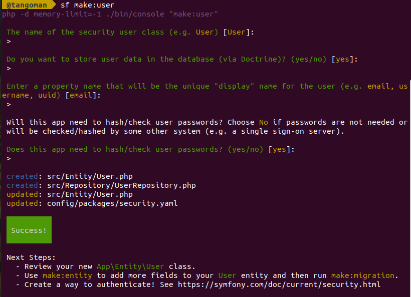

Le résultat de cette commande se trouve dans le fichier : [./src/Entity/User.php](./src/Entity/User.php)

Cette commande a aussi créé le _repository_ qui correspond : [./src/Repository/UserRepository.php](./src/Repository/UserRepository.php)

Un _Repository_ est une classe utilisée par _Doctrine_ pour faire des _requêtes_ en base de donnée.
Si à l'avenir vous avez besoin de faire une _requête_ avec des critères un peu plus élaborés que les _méthodes_ de base, c'est à cet endroit qu'il faudra ajouter du code.

Enfin cette commande a mis à jour les paramètres de sécurité dans le fichier [./config/packages/security.yaml](./config/packages/security.yaml)

### 👉 Création de l'entité "Transaction"

On va entrer cette commande et se laisser guider à nouveau.

```bash
$ bin/console make:entity
```

📝 NOTE : Apparemment, le mot `transaction` est réservé par _Doctrine_ et cause une erreur lors du `persist`:
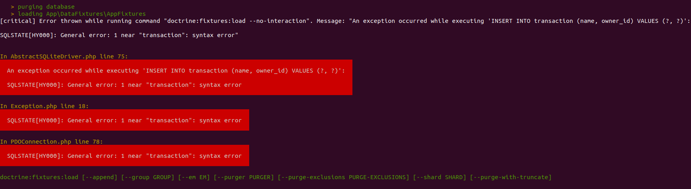

Ce bug de l'espace m'a bien fait rager, il m'a bien fallu 15 minutes pour comprendre le problème... Les joies du code 😓.

Je me demande si nos amis de chez _PayGreen_ n'auraient pas essayé de me tendre un piège. 🤔

L'entité ne peut pas s'appeler "Transaction", je la renomme en "Operation", qui est le mot qui se rapproche le plus de notre domaine sémantiquement.

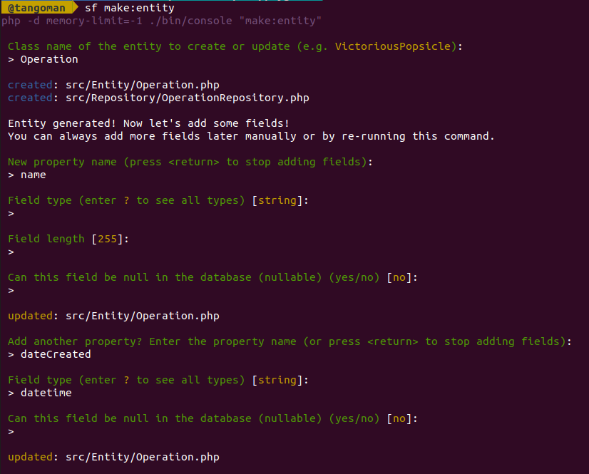
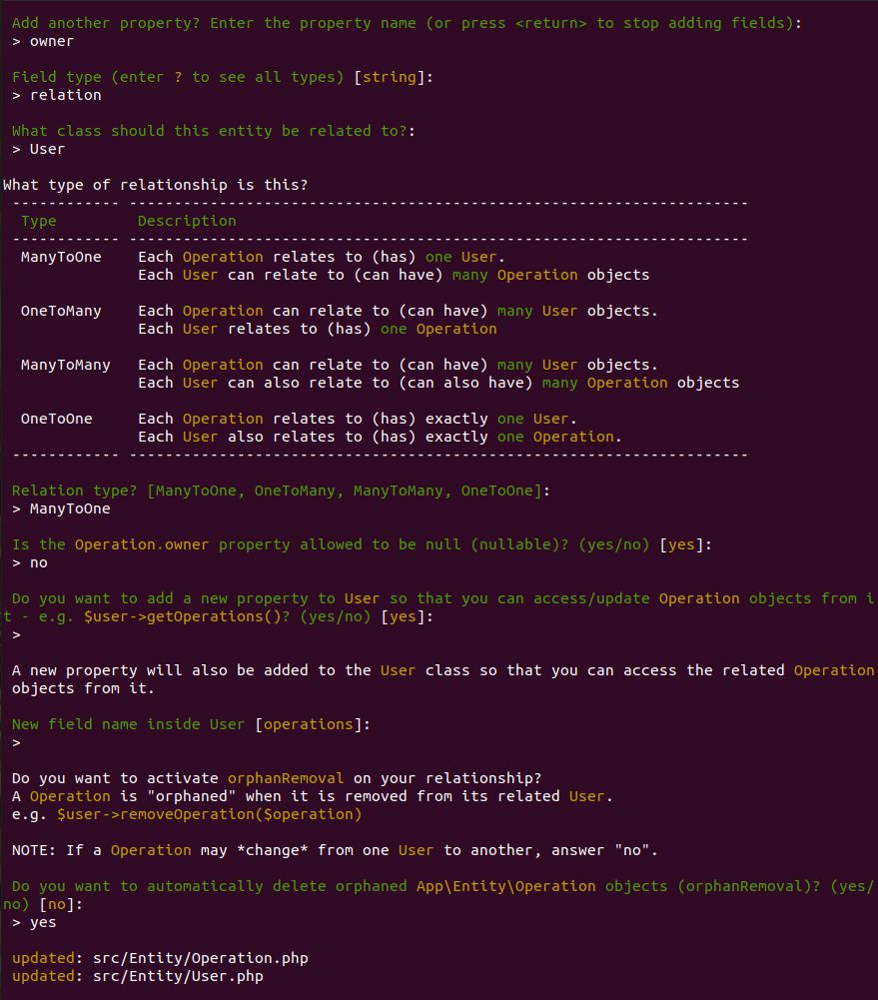

Ça passe...

Au final de notre fichier ressemble à ça : [./src/Entity/Operation.php](./src/Entity/Operation.php)
Et notre _repository_ ressemble à ça : [./src/Repository/OperationRepository.php](./src/Repository/OperationRepository.php)

La logique de cet objet est de représenter un événement, elle aura donc au minimum une propriété `dateCreated` de type `\DateTime` je suppose.

**❗ IMPORTANT ❗**

L'_entité_ `User` va avoir une _relation_ `ManyToOne` avec l'_entité_ `Operation`.

La propriété `owner` d'une _opération_ qui représente la relation avec l'utilisateur n'est pas _nullable_. En effet ça n'aurait pas de sens de créer une _opération_ qui n'appartient à personne.

6 ⚡ Création de la base de donnée et du schéma
-----------------------------------------------

Les commandes suivantes vont créer la base de donnée et le schéma de notre application que nous venons de définir.

```bash
$ ./bin/console doctrine:database:create
$ ./bin/console doctrine:schema:create
```

Dans le dossier `./var` un fichier `database.db` a été généré.
Si on ouvre ce fichier dans _DB Browser_ on peut voir que **Symfony** a créé ce schéma :

```sql
CREATE TABLE "user" (
    "id"    INTEGER NOT NULL PRIMARY KEY AUTOINCREMENT,
    "email" VARCHAR(180) NOT NULL,
    "roles" CLOB NOT NULL,
    "password"  VARCHAR(255) NOT NULL
);
CREATE TABLE "operation" (
    "id"    INTEGER NOT NULL PRIMARY KEY AUTOINCREMENT,
    "owner_id"  INTEGER NOT NULL,
    "name"  VARCHAR(255) NOT NULL,
    "date_created"  DATETIME NOT NULL,
    CONSTRAINT "FK_1981A66D7E3C61F9" FOREIGN KEY("owner_id") REFERENCES "user"("id") NOT DEFERRABLE INITIALLY IMMEDIATE
);
CREATE UNIQUE INDEX "UNIQ_8D93D649E7927C74" ON "user" (
    "email"
);
CREATE INDEX "IDX_1981A66D7E3C61F9" ON "operation" (
    "owner_id"
);
```

7 ⚡ Fixtures
-------------

Les fixtures vont nous éviter de devoir travailler avec des tables vides et nous permettent de tester notre application.

### 👉 Création des fixtures

Là encore le _maker_ nous aide à générer notre code.

```bash
$ bin/console make:fixture
```

Pour simplifier la création des relations nous allons faire une boucle dans une boucle. (C'est pas l'idéal, mais hé oh ! On a que 24h OK ! 😬)

Notre fichier va ressembler à ça : [./src/DataFixtures/AppFixtures.php](./src/DataFixtures/AppFixtures.php)

```php
# ./src/DataFixtures/AppFixtures.php
    // ...

    /**
     * create admin account and 10 users owning 10 transactions each.
     */
    public function load(ObjectManager $manager)
    {
        // ..

        $faker = Factory::create();

        for ($i = 0; $i < 5; ++$i) {
            $user = new User();
            $user->setEmail($faker->email);
            $user->setPassword(
                $this->passwordEncoder->encodePassword(
                    $user,
                    $faker->uuid
                )
            );
            $user->setRoles(['ROLE_USER']);

            for ($j = 0; $j < 5; ++$j) {
                $operation = new Operation();
                $operation->setName($faker->word);
                $operation->setDateCreated($faker->dateTimeBetween('-10 Days'));
                $operation->setOwner($user);

                $user->addOperation($operation);
                $manager->persist($operation);
            }

            $manager->persist($user);
            $manager->flush();
        }
    }
```

C'est également dans ce fichier que je vais créer le compte de l'administrateur, là encore c'est pas l'idéal... C'est juste un prototype.

```php
# ./src/DataFixtures/AppFixtures.php

        // ...

        // create admin account
        $user = new User();
        $user->setEmail('mat@tangoman.io');
        $user->setPassword(
            $this->passwordEncoder->encodePassword(
                $user,
                'tango'
            )
        );
        $user->setRoles(['ROLE_ADMIN']);

        $manager->persist($user);
        $manager->flush();

        // ...
```

Remarquez que nous avons utilisé le `UserPasswordEncoder` pour _hasher_ le mot de passe des utilisateurs, nous ferons la même opération dans le `SecurityController` pour la création de compte.

Pour info, la documentation des _formateurs_ (les fonctions qui génèrent les trucs) de _FakerPHP_ se trouve ici : [https://fakerphp.github.io/formatters](https://fakerphp.github.io/formatters)

### 👉 Chargement des fixtures

À cette étape en entrant la commande :

```bash
$ ./bin/console doctrine:fixtures:load --no-interaction
```

La base de donnée devrait s'_hydrater_ avec les bouchons générés par les _fixtures_. On peut le vérifier en ouvrant le fichier `./var/database.db` à l'aide de _DB Browser_.

Regardons dans l'onglet _Browse Data_: 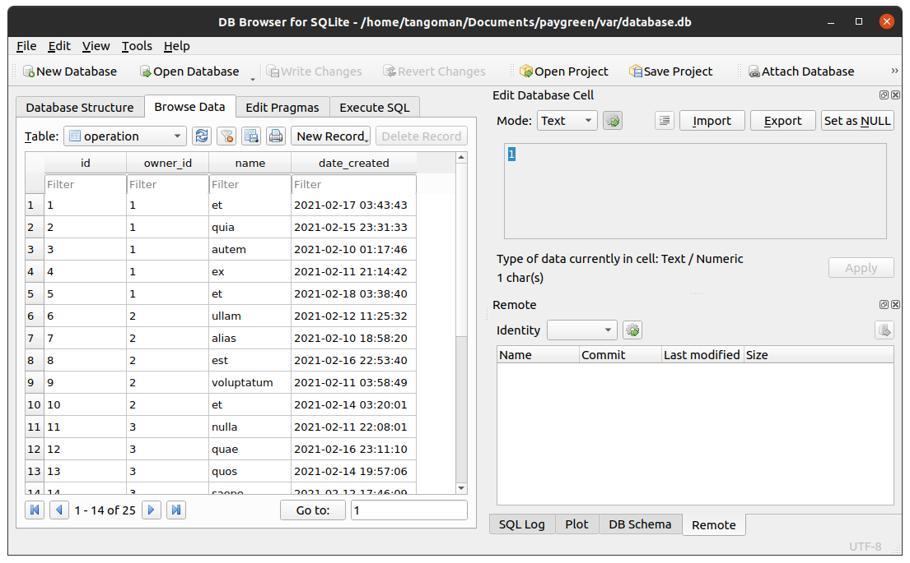

🎇 Youpi ! Nos tables sont bien remplies ! 🎊

8 ⚡ Création des encodeurs
----------------------------

La commande _maker_ va nous aider à créer les fichiers : [./src/Serializer/OperationEncoder.php](./src/Serializer/OperationEncoder.php) et [./src/Serializer/UserEncoder.php](./src/Serializer/UserEncoder.php)

```bash
$ bin/console make:serializer:encoder
```

Nous allons nommer nos _encodeurs_ `UserEncoder` et `OperationEncoder` et le nom de format sera `user:json`, et `operation:json` respectivement.

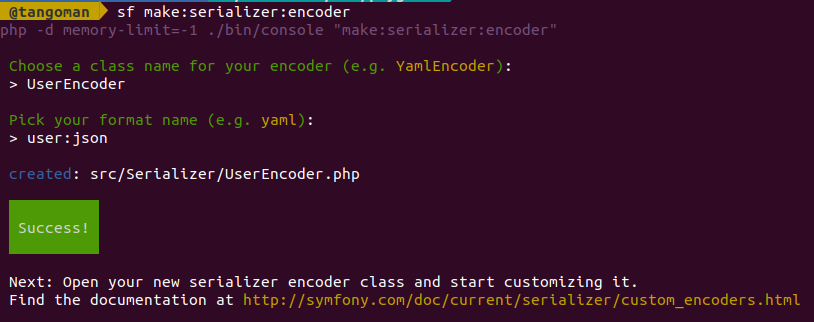
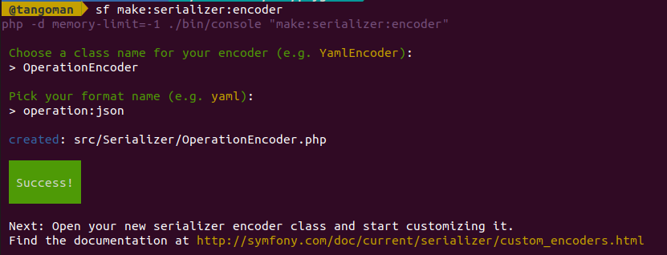

Chaque _encodeur_ doit contenir une méthode pour _décoder_ les données et les _transformer_ si nécessaire.

Dans la méthode `encode`, puisque nous allons recevoir une _collection_ d'_objets_ en entrée, nous allons parcourir le _tableau_ avec `array_map` et appliquer les transformations pertinentes dans la _méthode_ `encodeItem`.

```php
# src/Serializer/OperationEncoder.php
    //...

    public function encode($data, $format, array $context = [])
    {
        // encode data as json
        return $this->encoder->encode(
            array_map(
                [
                    $this,
                    'encodeItem',
                ],
                $data
            ),
            'json'
        );
    }

    //...
```

Par exemple je préfère que la propriété `dateCreated` d'une _opération_ soit représentée par un `timestamp` pour le client plutôt qu'un gros objet `dateTime` moche. Également les _relations_ de chaque objet sont remplacées par une `IRI`, le client devra faire une autre requête pour récupérer les objets enfants.

```php
# src/Serializer/OperationEncoder.php
    //...

    public function encodeItem(array $item): array
    {
        // transform dateTime to timestamp
        $item['dateCreated'] = $item['dateCreated']['timestamp'] ?? null;

        // encode relation as IRI
        $item['owner'] = sprintf('/user/%s', $item['owner']['id']);

        return $item;
    }

    //...
```

9 ⚡ Contrôleurs
-----------------

Un _contrôleur_ est le cerveau d'une application ; Il définit les _actions_, les _routes_, connecte les données de la base et la logique des _services_... En résumé c'est l'élastique qui tient le slip de notre _API_.

### 👉 Création des contrôleurs

```bash
$ bin/console make:controller
```

Vous commencer à avoir l'habitude, la commande ci-dessus nous guide pour la création de nos _contrôleurs_ :
Comme vous l'avez sûrement deviné, nous allons nommer nos _contrôleurs_ `OperationController` et `UserController`.

**❗ IMPORTANT ❗**

Puisque nos entités ont une relation, les _contrôleurs_ doivent instancier correctement le _sérialiseur_ pour éviter les références circulaires lors de l'encodage tel que c'est indiqué dans la documentation de **Symfony** :[https://symfony.com/doc/current/components/serializer.html#handling-circular-references](https://symfony.com/doc/current/components/serializer.html#handling-circular-references)

```php
# ./src/Controller/OperationController.php
    // ...
    private serializer;

    public function __construct()
    {
        $encoder = new OperationEncoder();
        $defaultContext = [
            AbstractNormalizer::CIRCULAR_REFERENCE_HANDLER => function ($object, $format, $context) {
                return $object->getId();
            },
        ];
        $normalizer = new ObjectNormalizer(null, null, null, null, null, null, $defaultContext);
        $this->serializer = new Serializer([$normalizer], [$encoder]);
    }
    // ...
```

### 👉 Création des routes

Nos _contrôleurs_ contiennent quatre _actions_ chacuns :

[./src/Controller/UserController.php](./src/Controller/UserController.php)

|  verbe   |    route    |         permissions          |            description             |
|----------|-------------|------------------------------|------------------------------------|
| `GET`    | /users      | ROLE_ADMIN                   | Retourne la liste des utilisateurs |
| `POST`   | /users      | ROLE_ADMIN                   | Crée un nouvel utilisateur         |
| `GET`    | /users/{id} | IS_AUTHENTICATED_ANONYMOUSLY | Retourne un utilisateur            |
| `DELETE` | /users/{id} | ROLE_ADMIN                   | Supprime un utilisateur            |

[./src/Controller/OperationController.php](./src/Controller/OperationController.php)

|  verbe   |      route       | permissions |           description            |
|----------|------------------|-------------|----------------------------------|
| `GET`    | /operations      | ROLE_USER   | Retourne la liste des operations |
| `POST`   | /operations      | ROLE_USER   | Crée une nouvelle operation      |
| `GET`    | /operations/{id} | ROLE_USER   | Retourne une operation           |
| `DELETE` | /operations/{id} | ROLE_USER   | Supprime une operation           |

📝 NOTE : Les _routes_ n'ont pas forcément besoin de propriété `name`, **Symfony** attribue un nom par défaut aux _actions_ des _contrôleurs_, regardons ça de plus près :

```bash
$ bin/console debug:router
```

Le nom des _routes_ correspond par défaut au `Namespace` de notre application, suvi du nom du _contrôleur_, et du nom de l'_action_.

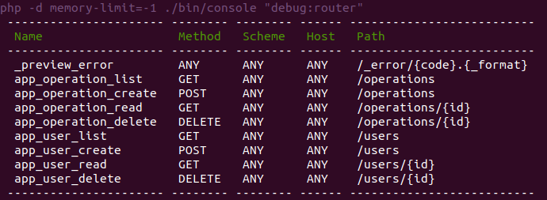

Dans la mesure où nous n'allons pas utiliser _Twig_, et qu'il n'y pas de raison de renommer les actions tous les quatre matins, ça nous convient parfaitement.

10 ⚡ Essayons d'envoyer des requêtes
-------------------------------------

Notre projet commence à prendre tournure :
[./src/Controller/OperationController.php](./src/Controller/OperationController.php), [./src/Controller/UserController.php](./src/Controller/UserController.php)

Commençons par démarrer le serveur local de **Symfony** avec cette commande :
```bash
$ symfony server --no-tls
```
Où cette commande si vous préférez utiliser le serveur interne de **PHP** :
```bash
$ php -d memory-limit=-1 -S "127.0.0.1:8000" -t "./public"
```

Puis ouvrons _Insomnia_ et essayons de récupérer nos données.

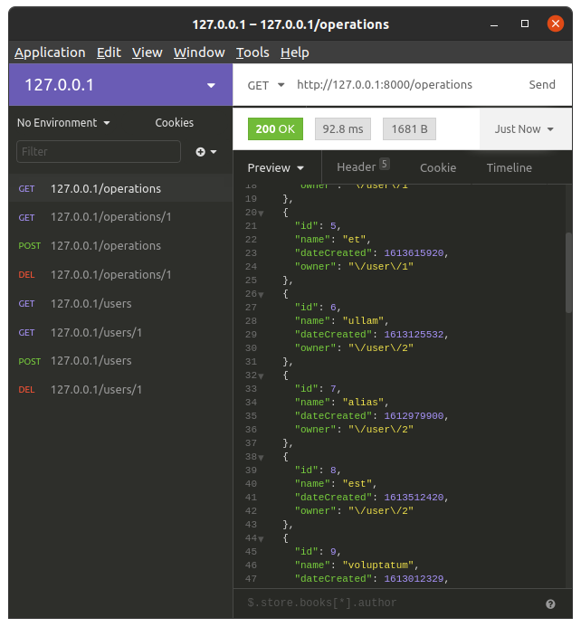
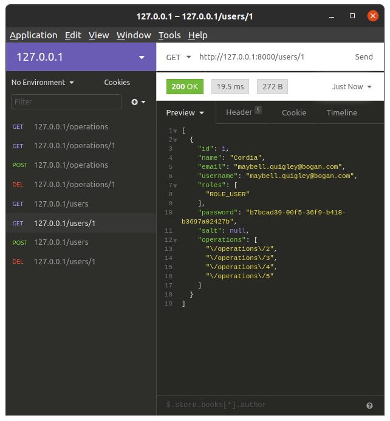

C'est good 👍.

Essayons de supprimer un élément maintenant.

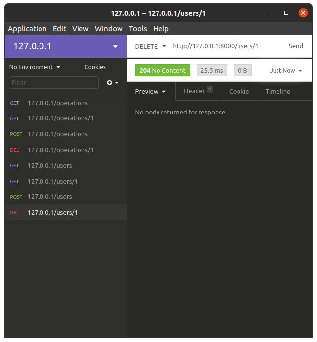

Yes ! Ça marche !!


11 ⚡ Gestion de la création d'un nouvel élément
------------------------------------------------

Pour la gestion du `POST` c'est un peu plus difficile parcequ'il va falloir gérer la création des _relations_ ; On va commencer par l'_entité_ `User`.

### 👉 La sérialisation: UserEncoder

Dans le `UserEncoder` on va devoir transformer les _opérations_ enfants de notre `item`.
Pour ça nous avons besoin d'_injecter_ le `OperationRepository` dans le constructeur de l'_encodeur_.

```php
# ./src/Serializer/UserEncoder.php
use App\Repository\OperationRepository;

    // ...

    private $operationRepository;

    public function __construct(OperationRepository $operationRepository)
    {
        $this->operationRepository = $operationRepository;
        // ...
```

Sans oublier de passer l'_argument_ depuis le _contrôleur_ également.

```php
# ./src/Controller/UserController.php
use App\Repository\OperationRepository;

    // ...

    public function __construct(OperationRepository $operationRepository)
    {
        $encoder = new UserEncoder($operationRepository);
        // ...
```

L'action `create` du _contrôleur_ va _désérialiser_ le contenu de la _requête_ du client, puis _persister_ l'objet et le retourner au format `json` avec son identifiant (quand un objet possède un `id` c'est qu'il a bien été persisté).

Comme il faut aussi _persister_ les _relations_ de notre objet `User`, nous demandons à la _méthode_ `decode` d'aller chercher' en base de donnée chacune des _opérations_ que l'utilisateur possède.

```php
# ./src/Serializer/UserEncoder.php

    // ...

    public function decode($data, $format, array $context = [])
    {
        // ...

        // create relations
        $operations = [];
        foreach ($data['operations'] ?? [] as $operation) {
            // get id from IRI string
            $iri = explode('/', $operation);
            // request each object from database
            $operations[] = $this->operationRepository->find(\intval(end($iri)));
        }
        $data['operations'] = $operations;

        // ...
```

Je ne rentre pas dans les détails, mais ci-dessus je récupère l'`id` d'une opération en transformant le dernier élément de la _chaîne de caractères_ en _entier_ ; Il va de soit qu'en production on aurait pris au moins le soin de vérifier la validité de l'_IRI_.

### 👉 La sérialisation: OperationEncoder

Il faudra faire plus ou moins la même chose pour l'_entité_ `Operation` dans le _contrôleur_, mais dans la _méthode_ `decode` de `OperationEncoder` ça sera plus simple puisqu'il ne peut y avoir qu'un seul `User` lié à une _opération_.

```php
# ./src/Serializer/OperationEncoder.php

    // ...

    public function decode($data, $format, array $context = [])
    {
        // ...

        // create relation
        $iri = explode('/', $data['owner']);
        $data['owner'] = $this->userRepository->find(\intval(end($iri)));

        // ...
```

N'oublions pas qu'une _opération_ ne peut pas exister sans utilisateur pour la créer !

### 👉 Testons

Postons une _opération_ nommée `test_create_operation` dont le propriétaire porte l'`id` numéro `1` (il existe déjà normalement, c'est l'administrateur) :

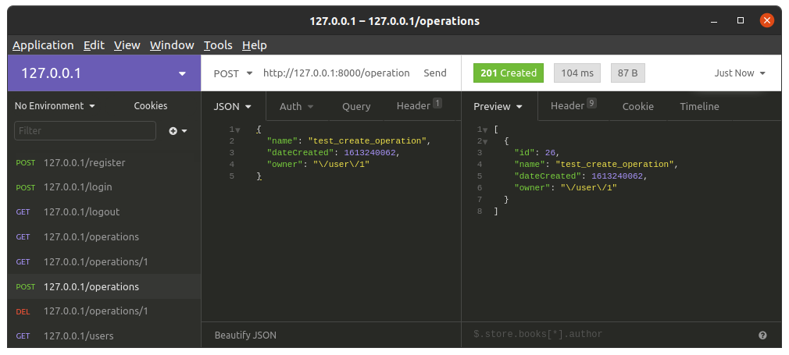

Vérifions que le `User` avec l'id `1` possède bien l'_opération_ avec l'id `26` que l'_API_ vient de nous retourner.

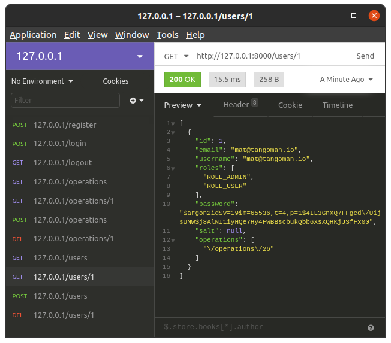

**🎺 Ça marche ! JOIE ! 🎷**


Tout est prêt pour la dernière étape.

12 ⚡ Création de l'authentification
------------------------------------

Nous voulons permettre aux utilisateurs de s'enregistrer et de se connecter en `json` à l'aide du _header_ `Content-Type: application/json` dans l'entête de la requête.

### 👉 Création des actions du "SecurityController"

Le `SecurityController` contient trois actions :

[./src/Controller/SecurityController.php](./src/Controller/SecurityController.php)

| verbe |   route   |         permissions        |            description            |
|-------|-----------|-----------------------------|-----------------------------------|
| POST  | /register |                             | Création d'un compte utilisateur  |
| POST  | /login    |                             | Connexion d'un compte utilisateur |
| GET   | /logout   | IS_AUTHENTICATED_REMEMBERED | Déconnexion d'une session         |

La commande `debug:router` nous retourne ce magnifique tableau, tout va bien :

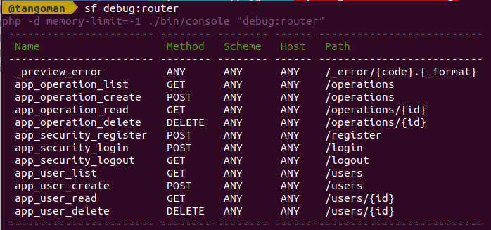

### 👉 Configuration du firewall

Le _firewall_ (pare-feu) de **Symfony** centralise toute la configuration de la sécurité de notre application. Faites correspondre votre configuration avec le fichier ci-dessous.

```yaml
# ./config/packages/security.yaml
security:
    # ...

    providers:
        app_user_provider:
            entity:
                class: App\Entity\User
                property: email
                # ...

        main:
            anonymous: true
            lazy: true

            json_login:
                check_path: app_security_login

            logout:
                path: app_security_logout
                invalidate_session: true

            provider: app_user_provider
```

### 👉 Création d'un compte utilisateur

Un utilisateur peut créer un compte sur l'_API_ en enregistrant son email et son mot de passes en `POST` au format `json` avec le type `Content-Type: application/json` contenu dans le _header_ de la requête à l'adresse [http://localhost:8000/register](http://localhost:8000/register)

```json
{
    "email": "mat@tangoman.io",
    "password": "tango"
}
```

Essayons dans _Insomnia_:

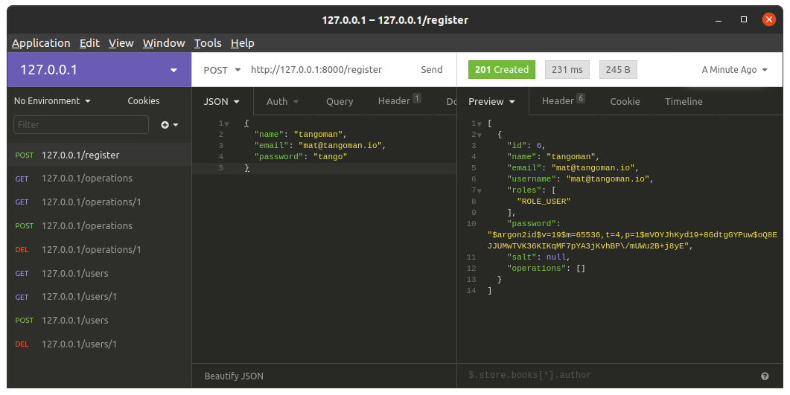

🎉 OUIIIii ! ÇA MARCHE !

### 👉 Le point d'entrée pour le login

La documentatioon de **Symfony** nous indique la marche à suivre pour créer un système de _login_ en `json` : [https://symfony.com/doc/current/security/json_login_setup.html](https://symfony.com/doc/current/security/json_login_setup.html)

L'utilisateur peut maintenant se connecter à l'_API_ en envoyant son nom d'utilisateur (l'email par défaut) et son mot de passes en `POST` au format `json` avec le type `Content-Type: application/json` contenu dans le _header_ de la requête à l'adresse [http://localhost:8000/login](http://localhost:8000/login)

```json
{
    "username": "mat@tangoman.io",
    "password": "tango"
}
```

### 👉 Logout

Et finalement l'utilisateur peut se déconnecter en faisant une requête `GET` à l'adresse [http://localhost:8000/logout](http://localhost:8000/logout)

13 ⚡ Permissions
-----------------

### 👉 Création de la hiérarchie des rôles

Un administrateur doit automatiquement avoir les mêmes droits qu'un utilisateur, ajoutons ce _paramètre_ dans la _config_ du _firewall_.

```yaml
# ./config/packages/security.yaml
security:
    # ...

    role_hierarchy:
        ROLE_ADMIN: ROLE_USER
```

### 👉 Création des permissions

Il faut maintenant ajouter les _annotations_ `@isGranted` sur les actions des _contrôleurs_ pour limiter l'accès aux _routes_ uniquement aux utilisateurs autorisés. Nous allons suivre les indications de la documentation de **Symfony** : [https://symfony.com/doc/current/bundles/SensioFrameworkExtraBundle/annotations/security.html](https://symfony.com/doc/current/bundles/SensioFrameworkExtraBundle/annotations/security.html)

Un utilisateur peut créer une _opération_ uniquement s'il est connecté, sinon le serveur lui envoie une erreur `401` :

```php
# ./src/Controller/OperationController.php

    // ...

    /**
     * @Route("/operations", methods={"POST"})
     * @isGranted("IS_AUTHENTICATED_FULLY", statusCode=401, messsage="Unauthorized")
     *
     * @param Request                $request
     * @param EntityManagerInterface $entityManager
     *
     * @return Response
     */
    public function create(Request $request, EntityManagerInterface $entityManager): Response
    {
        // ...
```

Les administrateurs uniquement sont autorisés à obtenir la liste les utilisateurs.

```php
# ./src/Controller/UserController.php

    // ...

    /**
     * @Route("/users", methods={"GET"})
     * @isGranted("ROLE_ADMIN", statusCode=401, messsage="Unauthorized")
     *
     * @param UserRepository $userRepository
     *
     * @return Response
     */
    public function list(UserRepository $userRepository): Response
    {
        //...
```

Voilà ! Essayons de nous connecter... Par défaut, à la connection l'application nous retourne l'utilisateur avec ses _roles_ ;

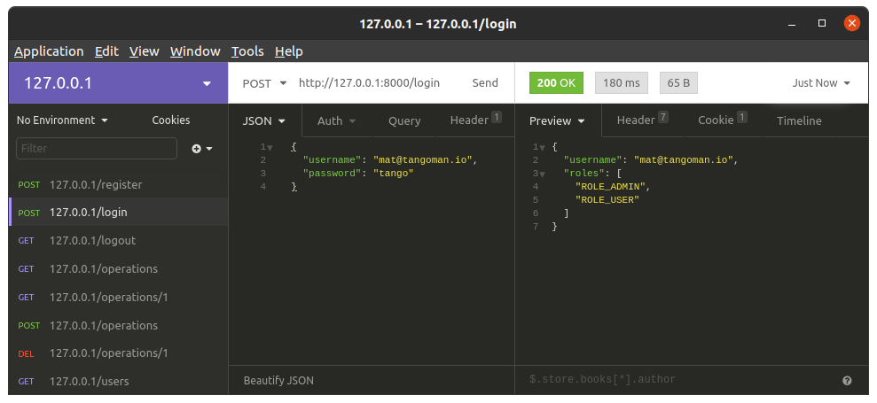

🎉 C'EST UN SUCCÈS ! 🎉

⚡ Conclusion
-------------

Et voilà, cette petite victoire sonne la fin de mon marathon !


Et si vous avez suivi jusque-là, **félicitations à vous aussi les amis !**


J'espère que vous avez pris goût à Linux, PHP et **Symfony** !

Pour me contacter :

[](mailto:mat@tangoman.io) 
[](https://tangoman.io) 
[](https://github.com/TangoMan75) 
[](https://linkedin.com/in/matthiasmorin) 
[](https://twitter.com/tangomanparis)

Et si j'avais eu plus de temps ?
--------------------------------

- En premier lieu, j'aurai pris le temps d'écrire des tests unitaires, test d'intégration et des tests fonctionnels avec [PHPUnit](https://phpunit.de) et [Panther](https://github.com/symfony/panther).
- J'aurai implémenté les permissions avec des _voteurs_. [https://symfony.com/doc/current/security/voters.html](https://symfony.com/doc/current/security/voters.html)
- Pour le moment rien n'empêche une personne mal intentionnée de créer des milliers de comptes avec un bot, un envoi d'email pour une vérification ça ne ferait pas de mal.
- J'aurai mis en place un système de pagination pour les listes.
- J'aurai géré le `PUT` et le `PATCH`.
- J'aurai géré les erreurs avec des réponses en `json` qui vont bien.
- J'aurai fait une commande pour créer des utilisateurs (admins).
- J'aurai implémenté des relations bidirectionnelles dans les entités avec des `persist={cascade}`
- J'aurai _conteneurisé_ l'_API_ et mis en place `PostgreSQL` avec [Docker](https://www.docker.com).
- J'aurai mis en place l'intégration et le déploiement continu avec [GitHub Actions](https://github.com/features/actions).
- J'aurai mis en place [Traefik](https://containo.us/traefik) pour gérer le reverse proxy, le SSL et le load balancing.

